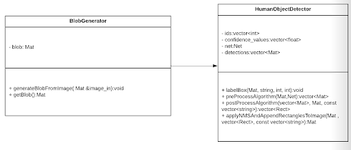
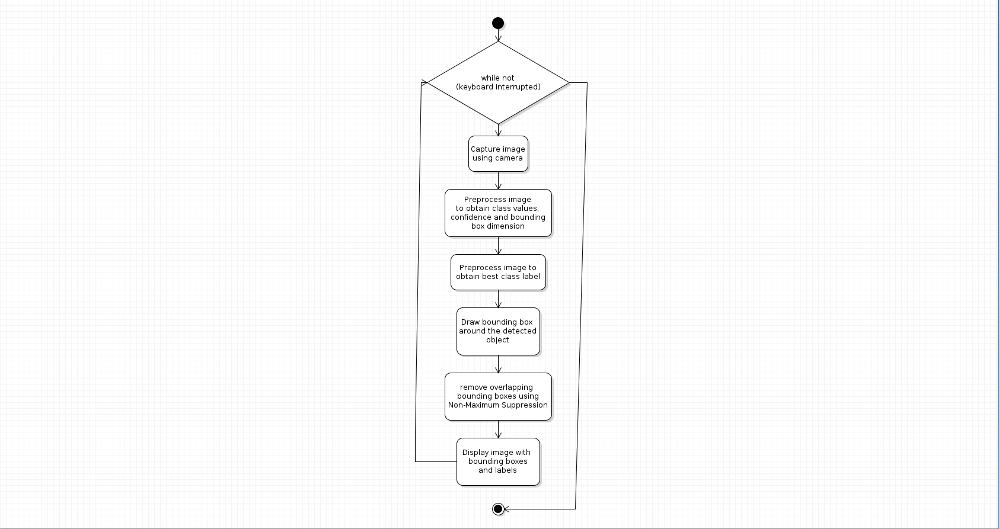

## Midterm - Human Object Detection
# C++ Boilerplate Badges
[](https://github.com/joshuag1214/Midterm-Project--ENPM808X/actions/workflows/build_and_coveralls.yml)

[](https://coveralls.io/github/joshuag1214/Midterm-Project--ENPM808X?branch=master)


### Authors and Roles
Phase1:
Driver- Aniruddh Balram,
Navigator-Mayank Sharma,
Design Keeper- Joshua Gomes

Phase2:
Driver- Joshua Gomes,
Navigator-Aniruddh Balram,
Design Keeper-Mayank Sharma


### Introduction
Human (N>=1) obstacle detector and tracker based on C++ and OpenCV that employ a computer vision algorithm for location and categorization of human(N>=1) in the picture.
We are seeking to create this tracker utilizing a monocular camera, directly usable in a robot’s reference frame according to the need specifications supplied to us by ACME robotics .

For human recognition and tracking, we will use the robust YOLOv3 neural network model trained on the COCO dataset, which is one of the most accurate real-time object detection techniques. 


### UML Diagram:


### Activity Diagram:


### Tasks complete
IB: 1.101 Get preprocessing working 
IB: 1.102 Get postprocessing working 
IB: 1.103 Setup coverCV 
IB: 1.105 Create an iteration development branch/ development branch 
IB: 1.106 Select and add a software license as a file named LICENSE 
IB: 1.107 Update UML 
IB: 1.110 Update readme 
IB: 1.112 Create classes for program 
IB: 1.113 Implement cpplint and cppcheck 
IB: 1.114 Create proper comments and revise old ones 
IB: 1.115 Update Cmake

###Task incomplete
!!!!! IB: 1.104 Setup Github CI 
!!!!!!IB: 1.108 Create a docs directory with generated Doxygen files 
!!!!!!IB: 1.109 Create unit tests and test coverage 
!!!!!IB: 1.111 URL of a 3 minute (max) video explaining the Phase 1 status of your API 

### Steps to run: 
```
# Create build directory and switch into it
mkdir -p build && cd build

# Configure
cmake  ../opencv

#Build
cmake --build .

cd <directory_of_repo>/Code
bash run_detector.sh
```
